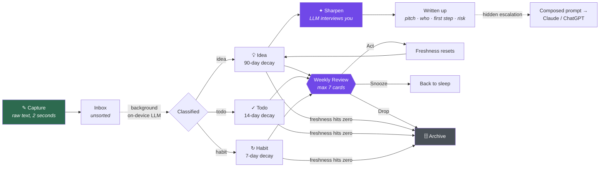
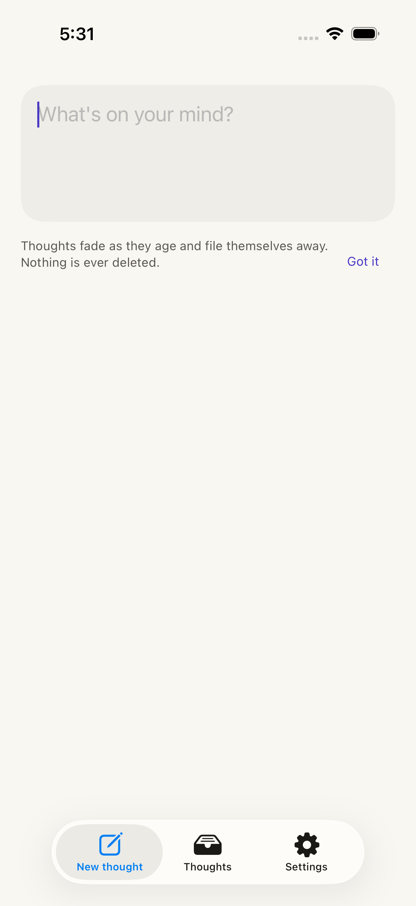
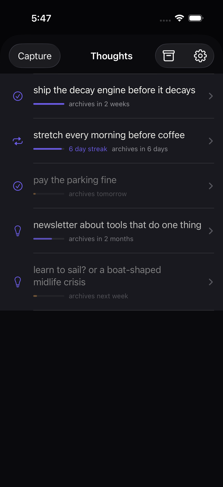
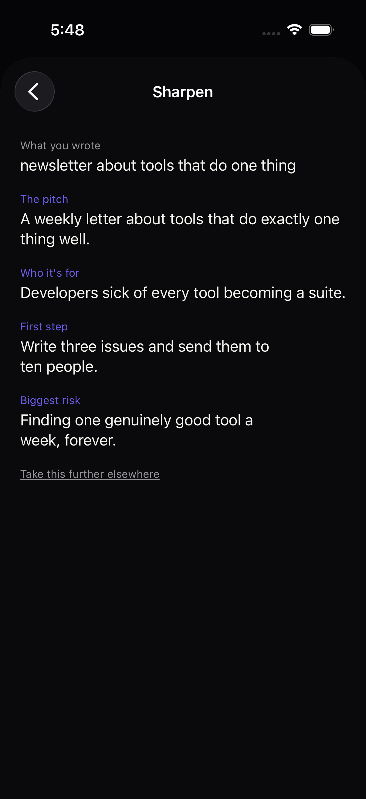
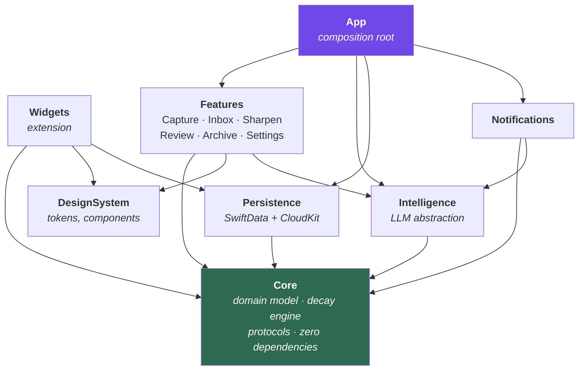

<div align="center">

# Fleeting

**An iOS app for thoughts that arrive at the wrong moment.**

*Ideas are fleeting. This app treats them that way.*


[](https://github.com/Himir-Desai/Fleeting/actions/workflows/ci.yml)

</div>

---

## The problem

Good ideas show up at the worst possible times — mid-conversation with friends, or thirty seconds
before falling asleep. Two things then go wrong with every note app I've tried:

1. **Capture is too slow.** Open app → pick a notebook → pick a template → choose a tag → *now* type.
   By the time the keyboard appears, the thought is gone, or I've decided it wasn't worth it.
2. **Nothing ever leaves.** Whatever does get written down sits in an infinite list forever. After a
   month the list is archaeology, not a tool. The good ideas are buried under the dead ones, so I
   stop opening it at all, so I stop capturing — and the loop closes.

Existing apps solve neither, because they're built to *store* notes. Fleeting is built to **catch a
thought in under two seconds, then make sure it either grows into something or gets out of the way.**

## The thesis

> A thought you never revisit is worthless, and a list you never prune is unreadable.
> So: make capture instant, make everything decay, and put the only work at the *end* of the
> lifecycle instead of the beginning.

Fleeting inverts the usual note-app deal. You give it a fragment — badly worded, half-formed, one
hand on the phone in the dark. It handles the filing. Later, on its own schedule, it comes back and
makes you decide what the thing actually was.

## Product principles

These are load-bearing. Every design decision in this repo traces back to one of them.

| # | Principle | What it forbids |
|---|-----------|-----------------|
| 1 | **Capture is sacred.** The app cold-launches to a focused text field with the keyboard already up. | No launch modal, no onboarding gate, no "which folder?", no "what type is this?", no update-notes screen. Ever. |
| 2 | **Nothing lives forever.** Every thought carries a freshness that decays on a clock, and archives itself when it runs out. | No infinite list. No manual cleanup chores. |
| 3 | **The app does the sorting.** Titling and classification happen silently in the background after you've already left. | No required fields at capture. Corrections are one tap, never a form. |
| 4 | **Half-baked in, fully-baked out.** The on-device model interviews you about a fragment, then writes it up from *your* answers. | No one-shot "expand this" that invents an idea you didn't have. |
| 5 | **Quiet by default.** At most one gentle nudge a day; the weekly review is an invitation, never a blocker. | No badge-driven guilt. No dialog on launch. Nothing you *must* dismiss to type. |

## How a thought moves through the app



## Feature tour

### ✎ Capture — the only screen that matters



Cold launch lands on a cursor. Type, hit save, the field clears and waits for the next one. No
navigation, no decisions, no confirmation. Also reachable without unlocking, from a lock-screen
widget, a Control Center control, and an App Intent so Siri can take dictation into it.

### 🕯 Decay — the anti-hoarding mechanic



Every thought has a **freshness** value that falls over time, rendered as a quiet visual fade in the
list. Different kinds of thought rot at different speeds: a todo you ignored for two weeks is dead,
a business idea deserves three months. Freshness resets when you *do* something with a thought —
not merely when you look at it. When it reaches zero the thought archives itself, silently. Nothing
is ever deleted; the archive is fully searchable, it's just out of the way.

### ✦ Sharpen — half-baked in, fully-baked out



The differentiator. Tap Sharpen on a fragment and the on-device model asks **two or three short,
specific questions** — *fair by what, income or room size? who has this problem badly enough to pay?*
You answer in a line each. It then writes up a structured version: the pitch, who it's for, the first
concrete step, and the biggest risk. The output is grounded in your answers, so it's still your idea.

When a thought outgrows what an on-device model can do, a deliberately understated **escalate**
affordance has the local model compose a rich, context-loaded prompt and hand it to a full assistant
(Claude, ChatGPT) via the share sheet. Hidden by design — the app stays simple; the door is just there.

### ↻ Review — a ritual you'll actually finish
Once a week, Fleeting picks **at most seven** thoughts that genuinely need a decision — about to
expire, or snoozed one too many times — and deals them as a card stack. Act, Snooze, or Drop. A short
session you finish beats a complete one you abandon. Idea cards arrive with one ambient sharpening
question attached, so the ritual quietly does double duty.

### 🔔 Nudges — one a day, never in the way
A daily notification where the on-device model surfaces one genuinely forgotten thought and phrases
it in a way that might restart it. Plus a weekly review invitation and a heads-up before something
archives. All of it lives outside the app — opening Fleeting never costs you anything.

### ☁️ Sync
Local-first SwiftData with automatic private CloudKit sync. Offline always works; there's no account,
no server, and nothing leaves your iCloud.

## Architecture at a glance

Fleeting is a thin app target over a set of local Swift packages with a strictly enforced dependency
direction. The domain layer has zero framework dependencies and is exhaustively unit-testable.



| Module | Responsibility | Depends on |
|---|---|---|
| `Core` | Domain entities, the decay engine, repository & service **protocols**. Pure Swift, no UIKit/SwiftUI/SwiftData. | *nothing* |
| `Persistence` | SwiftData schema, migrations, CloudKit configuration, repository **implementations**. | `Core` |
| `Intelligence` | `IntelligenceService` protocol with three implementations: on-device Foundation Models, deterministic heuristics, and a test stub. | `Core` |
| `DesignSystem` | Colour/type/spacing tokens and shared SwiftUI components. Owns the freshness visual language. | — |
| `Features` | One target per feature, each with its own `@Observable` state model and views. Features never import each other. | `Core`, `DesignSystem`, `Intelligence` |
| `Notifications` | Scheduling, background composition of the daily nudge, permission handling. | `Core`, `Intelligence` |
| `App` | Wiring only. Builds concrete implementations and injects them into features. | everything |

The full file-by-file map lives in **[ARCHITECTURE.md](ARCHITECTURE.md)**.

## Engineering practices

This is deliberately built the way a shipped app is built, not the way a demo is.

- **Modular by package.** Local SPM packages enforce layering at compile time — `Features` *cannot*
  import `Persistence`, because the dependency simply isn't declared.
- **Protocol-oriented intelligence.** Everything AI sits behind one protocol with three
  implementations, so the app is fully functional on hardware without Apple Intelligence, and every
  AI-touching code path is testable without a model.
- **Deterministic time.** The decay engine takes an injected `Clock`. Time-based behaviour is tested
  by advancing a fake clock, not by waiting.
- **Swift 6 strict concurrency,** actor-isolated persistence, `Sendable` domain types.
- **Testing** — unit tests on the pure domain and selection algorithms, integration tests against an
  in-memory SwiftData container, and a UI test that asserts the capture path stays modal-free.
- **CI** on every push: build, test, SwiftLint, SwiftFormat check.
- **Architecture Decision Records** in [docs/DECISIONS.md](docs/DECISIONS.md) — every significant
  choice recorded with its alternatives and its cost.
- **Built as a learning project, deliberately.** I came to this app fluent in other languages and new
  to Swift. The phase order in [docs/LEARNING.md](docs/LEARNING.md) doubles as a curriculum — each
  phase introduces the Swift and iOS concepts the app's next problem actually requires.

## Roadmap

Detail and acceptance criteria for each phase in **[docs/ROADMAP.md](docs/ROADMAP.md)**.

| Phase | Name | Ships | Status |
|---|---|---|---|
| 0 | Foundations | Project, packages, CI, design tokens, docs | 🟢 Done |
| 1 | Capture | Launch-to-cursor, persistence, raw inbox | 🟢 Done |
| 2 | Decay | Freshness engine, visual fade, auto-archive, search | 🟢 Done |
| 3 | Classification | Heuristic + on-device titling and typing, per-kind behaviour | 🟡 In progress |
| 4 | Sharpen | Interview flow, structured write-up, escalation | ⚪️ Planned |
| 5 | Review | Curated card stack, ambient sharpening | 🟡 In progress |
| 6 | Ambient | Daily nudge, widgets, Control Center, App Intents | ⚪️ Planned |
| 7 | Sync | CloudKit, conflict handling | ⚪️ Planned |
| 8 | Ship | Accessibility, motion, onboarding, TestFlight | ⚪️ Planned |

## Getting started

```bash
git clone <repo> && cd Fleeting
open Fleeting.xcodeproj
```

**Requirements:** Xcode 26+, iOS 26 SDK. Sharpen and classification use on-device Foundation Models
and require an Apple Intelligence capable device; everywhere else the app falls back to the heuristic
intelligence layer automatically and stays fully usable.

## Documentation

| Document | For |
|---|---|
| [ARCHITECTURE.md](ARCHITECTURE.md) | Complete file map, module boundaries, conventions, "where do I add X" |
| [docs/DECISIONS.md](docs/DECISIONS.md) | Architecture Decision Records — what was chosen, and what wasn't |
| [docs/ROADMAP.md](docs/ROADMAP.md) | Phase breakdown with scope and acceptance criteria |
| [docs/LEARNING.md](docs/LEARNING.md) | The Swift concepts each phase teaches, and the progress log |

---

<div align="center"><sub>Built by Himir Desai</sub></div>
