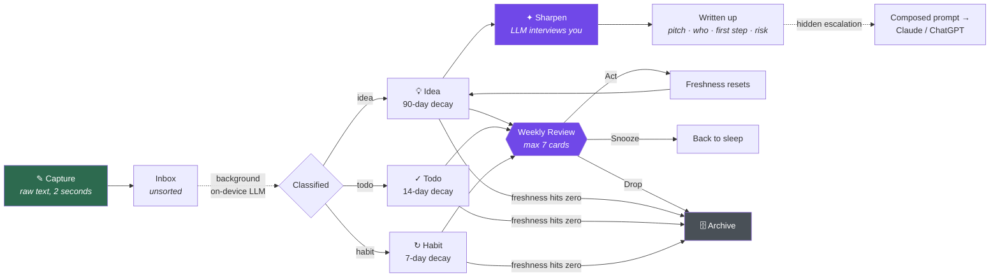
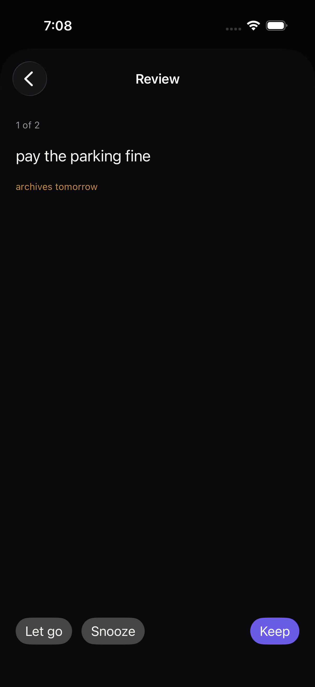
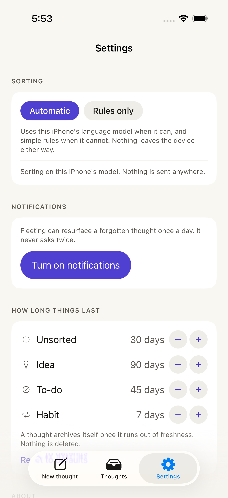
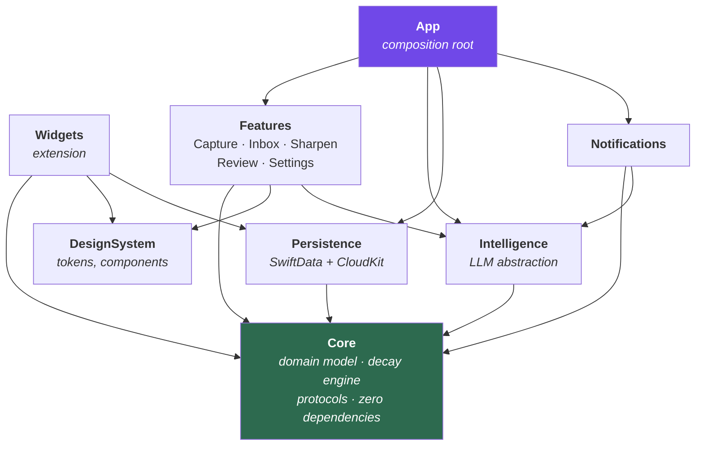

<div align="center">

# Fleeting

**An iOS app for thoughts that arrive at the wrong moment.**

*Ideas are fleeting. This app treats them that way.*


[](https://github.com/Himir-Desai/Fleeting/actions/workflows/ci.yml)

</div>

---

## The problem

Good ideas show up at the worst possible times — mid-conversation with friends, or thirty seconds
before falling asleep. Two things then go wrong with every note app I've tried:

1. **Capture is too slow.** Open app → pick a notebook → pick a template → choose a tag → *now* type.
   By the time the keyboard appears, the thought is gone, or I've decided it wasn't worth it.
2. **Nothing ever leaves.** Whatever does get written down sits in an infinite list forever. After a
   month the list is archaeology, not a tool. The good ideas are buried under the dead ones, so I
   stop opening it at all, so I stop capturing — and the loop closes.

Existing apps solve neither, because they're built to *store* notes. Fleeting is built to **catch a
thought in under two seconds, then make sure it either grows into something or gets out of the way.**

## The thesis

> A thought you never revisit is worthless, and a list you never prune is unreadable.
> So: make capture instant, make everything decay, and put the only work at the *end* of the
> lifecycle instead of the beginning.

Fleeting inverts the usual note-app deal. You give it a fragment — badly worded, half-formed, one
hand on the phone in the dark. It handles the filing. Later, on its own schedule, it comes back and
makes you decide what the thing actually was.

## Product principles

These are load-bearing. Every design decision in this repo traces back to one of them.

| # | Principle | What it forbids |
|---|-----------|-----------------|
| 1 | **Capture is sacred.** The app cold-launches straight onto the text field, one tap from writing, with today's habits the only other thing on the page. | No launch modal, no onboarding gate, no "which folder?", no "what type is this?", no update-notes screen. Ever. |
| 2 | **Nothing lives forever.** Every thought carries a freshness that decays on a clock, and archives itself when it runs out. | No infinite list. No manual cleanup chores. |
| 3 | **The app does the sorting.** Titling and classification happen silently in the background after you've already left. | No required fields at capture. Corrections are one tap, never a form. |
| 4 | **Half-baked in, fully-baked out.** The on-device model interviews you about a fragment, then writes it up from *your* answers. | No one-shot "expand this" that invents an idea you didn't have. |
| 5 | **Quiet by default.** At most one gentle nudge a day; the weekly review is an invitation, never a blocker. | No badge-driven guilt. No dialog on launch. Nothing you *must* dismiss to type. |

## How a thought moves through the app



## Feature tour

### ✎ Capture — the only screen that matters


Cold launch lands on the field. The page *is* the field: no well, no border, no options. Type, hit
save, and the words collapse into a one-line receipt telling you what they were filed as and how
long they have — `idea · 3 months` — before it retires itself. No navigation, no decisions, no
confirmation to dismiss. Also reachable without unlocking, from a lock-screen widget, a Control
Center control, and an App Intent so Siri can take dictation into it — and each of those still
arrives with the cursor already blinking, because they promised as much.

Underneath the field sit **the habits that are due**: the one kind of thought that has to be
touched on a rhythm, so the one kind that earns a place on the screen you land on. One tap keeps a
streak, and the card leaves immediately — the home screen is a list of what is outstanding, not a
roll call. They vanish the instant you start writing too, because a thought being written down is
not a screen you share, and the full list still lives in the Thoughts tab.

How often a habit is due comes from your own words: *"run every morning"* is daily, *"call mum on
sundays"* is weekly. Nothing is invented when the note is silent, and the rhythm is a picker on the
habit's own page. It sets when the habit reappears, what its streak is counted in — a weekly habit
kept four times is a four *week* streak — and how long it survives without attention.

### 🕯 Decay — the anti-hoarding mechanic


Every thought has a **freshness** value that falls over time, and the card is what shows it: as a
thought fades its surface blends toward the page and its shadow drops away, so one about to be
archived has visually almost rejoined the paper it is printed on. Different kinds rot at different
speeds: a todo you ignored for two weeks is dead, a business idea deserves three months.

The list is sorted by what you are about to lose, not by what you captured last — **Going soon**,
**This month**, **Plenty of time**. Freshness resets when you *do* something with a thought, not
merely when you look at it. When it reaches zero the thought archives itself, silently. Nothing is
ever deleted; the archive is a filter on the same list, one menu away, where a thought can be
restored to full freshness.

### ✦ Sharpen — half-baked in, fully-baked out


The differentiator. Tap Sharpen on a fragment and the on-device model asks **two or three short,
specific questions** — *fair by what, income or room size? who has this problem badly enough to pay?*
You answer in a line each. It then develops the fragment into a titled paragraph, built from your
answers rather than from the model's imagination — so it is still your idea, written out properly.
Changed your mind? **Revert** removes the write-up and the answers and leaves the note exactly as you
captured it.

On iOS 27, Fleeting uses the updated on-device model with capability checks and explicit structured
generation options. Requests on iOS 26.4 and later are checked against the model's context size,
including the output schema and response budget. Oversized requests fall back to local rules
without truncating your note. Sorting, interview questions, write-ups, and reminder copy use
structured output; no Private Cloud Compute or external model provider is used.

When a thought outgrows what an on-device model can do, a deliberately understated **escalate**
affordance has the local model compose a rich, context-loaded prompt and hand it to a full assistant
(Claude, ChatGPT) via the share sheet. Hidden by design — the app stays simple; the door is just there.

### ↻ Review — a ritual you'll actually finish



Once a week, Fleeting picks **at most seven** thoughts that genuinely need a decision — about to
expire, or snoozed one too many times — and deals them as a card stack. Keep, Snooze, or Let go,
by button or by swipe: left lets go, right keeps, up snoozes. All three are real decisions, so all
three carry the same visual weight; the screen does not lean on your arm.

It is a **tab**, not a link buried in the list — this is the half of the deal where the app comes
back and makes you decide, so it is a place you can go. Never presented on launch, never blocking.
A short session you finish beats a complete one you abandon. Idea cards arrive with one ambient
sharpening question attached, so the ritual quietly does double duty.

### 🔔 Nudges — one a day, never in the way



A daily notification where the on-device model surfaces one genuinely forgotten thought and phrases
it in a way that might restart it — in your own words, never scolding. Plus a weekly review
invitation, sent only when something actually needs deciding, and a single heads-up before the next
thought archives.

Permission is requested from Settings and nowhere else. The app never asks at launch, and never
twice. Copy is written ahead of time, because the on-device model cannot run when a notification
fires.

**Widgets** show what is still live and what is fading fastest, and a lock screen widget opens
straight into a blank note. **Siri** captures without opening the app at all — *"add to Fleeting"*.
Thought changes request a widget refresh; iOS controls when it runs. The free personal-team
build cannot share notes with widgets, so its widget explains the limitation and opens capture
when tapped.

### ✓ Plan — today, tomorrow, and the week ahead

Plan and Thoughts use the same to-dos. Tasks captured in **New thought** appear on their due day
(or capture day when no date is set); tasks added in Plan also appear in Thoughts. Tap task text
to open the same editing and action screen, including Delete, or use the row’s Edit/Delete context
menu. Existing standalone Plan tasks are imported automatically with their history preserved.

The **Plan** tab sits after Thoughts, with seven day buttons across the top. Pick a day, add a
short task, and tap its circle when it is finished. The compact entry row sits at the end of the
checklist: saving turns it into a task and leaves a fresh, focused input underneath. A strike-through draws across the words;
completed tasks remain on that day, and tapping again undoes completion. Previous and next week
controls let you plan across a week boundary. Tasks added to an earlier day also enter Review. The tab order is Home, Thoughts, Plan, Review, Settings.

At each new local calendar day, unfinished tasks from earlier days appear under **Review → Daily
tasks**. **Finished** marks a task done on its original day. **Not finished** moves the same task
to today, even after several days away. Nothing moves until you decide, and unfinished to-dos are not automatically archived by decay. Explicit Archive and Snooze actions
from the shared thought controls still apply.

**Today's plan** and **Tomorrow's plan** widgets show the checklist in small or medium sizes;
today also has lock-screen sizes. Home-screen checkboxes mark tasks done, and a review link opens
the pending daily decisions. Shared App Group storage is required to show and complete tasks in
widgets. Personal-team builds show an explanation and open Plan instead.

### ☁️ Sync
Local-first SwiftData with automatic private CloudKit sync. There is no account and no server, and
nothing leaves your iCloud. Signed out, the app is complete — it opens a device-local store and says
so in Settings rather than nagging you to sign in.

The interesting part is what CloudKit does to a schema. It merges a record **column by column**, so
a thought's lifecycle position and the date belonging to it — stored separately — could arrive from
two different devices and describe a state neither phone was ever in. Values that only mean
something together are now stored together, and a test demonstrates the tear on the old shape and
its absence on the new one. The migration keeps writing the old columns too, so installing an
earlier build over this one still reads correct data ([ADR-0019](docs/DECISIONS.md)).

### ♿︎ Accessibility — audited, not assumed

The fade is the app's signature and it was also its worst accessibility bug: at the opacity it
originally shipped, an old thought's text sat at **3.3:1** against the page, where the standard asks
for 4.5:1. That was found by a test, not by looking — every palette pairing is checked for WCAG
contrast in light, dark, and both increased-contrast appearances, and the build fails below AA.

The floor moved, one accent split into a fill colour and a text colour, and the forced dark
appearance went away. Under increased contrast the text stops fading entirely and the meter carries
the signal alone. VoiceOver reads a row as *"pay the parking fine, archives tomorrow"* with a value
of *"fading"* — words, not a percentage. Four UI tests drive capture, the inbox and the review at
the largest accessibility type size, where the review's three decisions stack rather than clip.

The audit keeps earning its place. Warming the palette to paper-and-ink later pushed that same fade
floor to **4.496:1** — three thousandths under the line, invisible to any eye and caught by the test
on the first run; the ink darkened rather than the floor moving. The same pass broke the capture
screen at 60pt type in a way no unit test could see, and `AccessibilityTests` caught that too: a
minimum height on the writing well, harmless at every normal size, pushed the save control off the
bottom of the screen once the keyboard was up.

## Architecture at a glance

Fleeting is a thin app target over a set of local Swift packages with a strictly enforced dependency
direction. The domain layer has zero framework dependencies and is exhaustively unit-testable.



| Module | Responsibility | Depends on |
|---|---|---|
| `Core` | Domain entities, the decay engine, repository & service **protocols**. Pure Swift, no UIKit/SwiftUI/SwiftData. | *nothing* |
| `Persistence` | SwiftData schema, migrations, CloudKit configuration, repository **implementations**. | `Core` |
| `Intelligence` | `IntelligenceService` protocol with three implementations: on-device Foundation Models, deterministic heuristics, and a test stub. | `Core` |
| `DesignSystem` | Colour/type/spacing/radius/elevation tokens and six shared components. Owns the freshness visual language. | — |
| `Features` | One target per feature, each with its own `@Observable` state model and views. Features never import each other. | `Core`, `DesignSystem`, `Intelligence` |
| `Notifications` | Scheduling, background composition of the daily nudge, permission handling. | `Core`, `Intelligence` |
| `App` | Wiring only. Builds concrete implementations and injects them into features. | everything |

The full file-by-file map lives in **[ARCHITECTURE.md](ARCHITECTURE.md)**.

## Engineering practices

This is deliberately built the way a shipped app is built, not the way a demo is.

- **Modular by package.** Local SPM packages enforce layering at compile time — `Features` *cannot*
  import `Persistence`, because the dependency simply isn't declared.
- **Protocol-oriented intelligence.** Everything AI sits behind one protocol with three
  implementations, so the app is fully functional on hardware without Apple Intelligence, and every
  AI-touching code path is testable without a model.
- **Deterministic time.** The decay engine takes an injected `Clock`. Time-based behaviour is tested
  by advancing a fake clock, not by waiting.
- **Swift 6 strict concurrency,** actor-isolated persistence, `Sendable` domain types.
- **Versioned storage.** The store has a `VersionedSchema` per shape and a migration plan between
  them, tested by opening a store written by the *previous* version and asserting nothing moved.
- **Accessibility is enforced, not attempted.** The colour contrast audit is a unit test that
  computes WCAG ratios for every palette pairing in light, dark, and both increased-contrast
  appearances, and fails the build below AA. UI tests drive the whole app at the largest
  accessibility type size.
- **The design system is a vocabulary, not a list of constants.** Features name a `Radius.card` or a
  `StatusBlock`, never a number or a hand-built stack, so the app's roundness, its elevation and its
  status lines are each one decision. Elevation is a *level* rather than a shadow, because a drop
  shadow on a near-black page is invisible — the same value is drawn as a hairline in dark mode
  ([ADR-0022](docs/DECISIONS.md)).
- **Testing** — 245 unit tests on the pure domain, the selection algorithms, the colour palette,
  and an in-memory SwiftData container, plus 46 UI tests on a simulator. Assertions are about
  mechanism, never about what a model happens to say.
- **CI** on every push: every package's tests, the app's UI tests on a simulator, SwiftLint,
  SwiftFormat check.
- **Architecture Decision Records** in [docs/DECISIONS.md](docs/DECISIONS.md) — every significant
  choice recorded with its alternatives and its cost.
- **Built as a learning project, deliberately.** I came to this app fluent in other languages and new
  to Swift, and the phase order was chosen so each one introduces the Swift and iOS concepts the
  app's next problem actually requires. [docs/LEARNING.md](docs/LEARNING.md) records what that
  covered through Phase 1, before the explicit teaching track was paused in favour of shipping.

## Roadmap

Detail and acceptance criteria for each phase in **[docs/ROADMAP.md](docs/ROADMAP.md)**.

| Phase | Name | Ships | Status |
|---|---|---|---|
| 0 | Foundations | Project, packages, CI, design tokens, docs | 🟢 Done |
| 1 | Capture | Launch-to-cursor, persistence, raw inbox | 🟢 Done |
| 2 | Decay | Freshness engine, visual fade, auto-archive, search | 🟢 Done |
| 3 | Classification | Heuristic + on-device titling and typing, per-kind behaviour | 🟢 Done |
| 4 | Sharpen | Interview flow, structured write-up, escalation | 🟢 Done |
| 5 | Review | Curated card stack, ambient sharpening | 🟢 Done |
| 6 | Ambient | Daily nudge, widgets, Siri capture | 🟢 Done |
| 7 | Sync | CloudKit, versioned migration, merge-safe schema | 🟢 Done¹ |
| 8 | Ship | Accessibility, contrast audit, motion, icon, privacy | 🟢 Done² |
| 9 | Daily plan | Seven-day checklist, explicit daily review, Today/Tomorrow widgets | 🟢 Implemented; device widget validation pending |

¹ Everything is built and tested except the one thing that needs two signed devices under one iCloud
account: convergence has not been *observed*.

² TestFlight distribution is being set up with the paid developer team. The regular Xcode project
and shared scheme are committed for Xcode Cloud; a successful cloud archive/upload is still pending.
The free personal-team install remains an alternative ([docs/INSTALL.md](docs/INSTALL.md)).

## Getting started

```bash
git clone <repo> && cd Fleeting
open Fleeting.xcodeproj
```

**Requirements:** Xcode 27+ and the iOS 27 SDK. Use [XcodeGen](https://github.com/yonaskolb/XcodeGen)
when editing `project.yml`; regenerate and commit the project, shared scheme, plists and entitlements together. The app still runs on iOS 26+. Sharpen
and classification use on-device Foundation Models and require an Apple Intelligence capable device;
everywhere else the app falls back to the heuristic intelligence layer automatically and stays fully
usable.

### Putting it on a phone

No App Store, no TestFlight — just your own phone, signed with your own free Apple ID:

```bash
Tools/install-device.sh
```

It finds the phone and reads your Team ID out of your signing certificate, so there is nothing to
export. Then trust the signature on the phone: Settings ▸ General ▸ VPN & Device Management. A free
signature lasts seven days; re-run the script to renew it, and your thoughts are untouched. A
personal team cannot issue the iCloud or App Group entitlements, so that build is device-local and
says so in Settings. First-time setup and troubleshooting in
[docs/INSTALL.md](docs/INSTALL.md).

## Documentation

| Document | For |
|---|---|
| [ARCHITECTURE.md](ARCHITECTURE.md) | Complete file map, module boundaries, conventions, "where do I add X" |
| [docs/INSTALL.md](docs/INSTALL.md) | Building it onto your own iPhone with a free Apple ID |
| [docs/PRIVACY.md](docs/PRIVACY.md) | What is stored, what is not, and the privacy manifest |
| [docs/ASSETS.md](docs/ASSETS.md) | Regenerating the app icon and the screenshots |
| [docs/DECISIONS.md](docs/DECISIONS.md) | Architecture Decision Records — what was chosen, and what wasn't |
| [docs/ROADMAP.md](docs/ROADMAP.md) | Phase breakdown with scope and acceptance criteria |
| [docs/LEARNING.md](docs/LEARNING.md) | The Swift concepts each phase covers — paused after Phase 1 |

---

<div align="center"><sub>Built by Himir Desai</sub></div>
